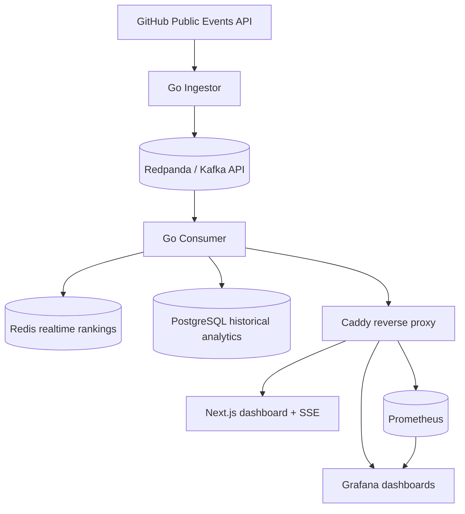
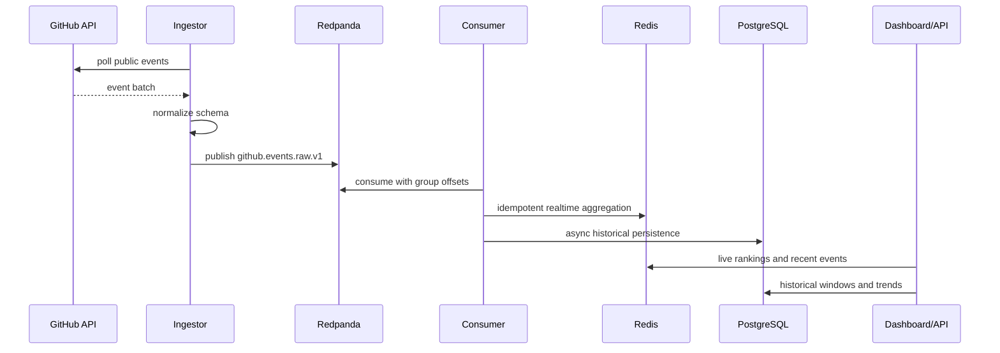
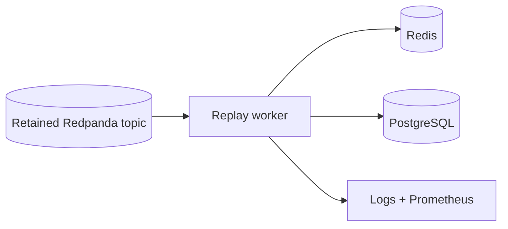

# GitHub Pulse

GitHub Pulse is a production-style distributed event analytics platform that ingests GitHub public events, streams them through a Kafka-compatible event bus, builds realtime rankings, persists historical analytics, and exposes operational dashboards.

This is not a GitHub clone. It is an infrastructure-focused backend project for demonstrating event-driven architecture, stream processing, idempotent consumers, replayability, observability, and operational recovery.

## Highlights

- Go ingestion service polling the GitHub Public Events API
- Redpanda/Kafka-compatible event streaming
- Idempotent Go consumer with Redis realtime rankings
- PostgreSQL durable historical analytics
- Replay/backfill foundation with bounded replay controls
- Next.js operational dashboard with SSE updates
- Prometheus, Grafana, Caddy, and infrastructure exporters
- k6 load tests, synthetic benchmark producer, and recovery drills
- Single-node AWS EC2 deployment optimized for cost and clarity

## Demo Surfaces

When deployed, the main entrypoints are:

- Dashboard: `http://<host>/`
- Grafana: `http://<host>/grafana/`
- Prometheus: `http://<host>/prometheus/`
- Trending API: `http://<host>/api/trending/repos`
- SSE stream: `http://<host>/api/events/stream`

## Screenshots

Add screenshots or GIFs from a live deployment:

- `docs/screenshots/dashboard-overview.png`
- `docs/screenshots/trending-repositories.png`
- `docs/screenshots/live-events.png`
- `docs/screenshots/grafana-system-overview.png`
- `docs/screenshots/grafana-performance-resilience.png`

Recommended capture flow:

1. Run `make bench-small` to generate visible traffic.
2. Open the dashboard and Grafana with a 30-minute time range.
3. Capture the operational views after Prometheus has scraped for a few minutes.

## Architecture



Redis remains the realtime hot path. PostgreSQL stores durable event metadata, hourly repository score snapshots, and aggregation windows for historical APIs and replay/backfill recovery.

See `docs/architecture.md` for system, event flow, replay, observability, and deployment diagrams.

## Project Structure

```text
cmd/ingestor          Go ingestion service
cmd/consumer          Kafka consumer, Redis aggregation, API/SSE server
cmd/replay            replay/backfill worker
cmd/benchgen          synthetic benchmark producer
frontend              Next.js operational dashboard
internal              Go service packages
ops/caddy             reverse proxy configuration
ops/grafana           dashboard provisioning
ops/prometheus        scrape configuration
ops/k6                API and SSE load tests
docs                  architecture, deployment, observability, runbooks
```

## Event Flow



## Kafka-Compatible Topics

| Topic                  | Purpose                                                           |
| ---------------------- | ----------------------------------------------------------------- |
| `github.events.raw.v1` | Normalized GitHub public events produced by the ingestion service |

## Event Schema

Events published to Kafka use the normalized schema in `internal/events`:

- `schema_version`
- `source`
- `event_id`
- `event_type`
- `actor_id`
- `actor_login`
- `repo_id`
- `repo_name`
- `repo_url`
- `public`
- `created_at`
- `ingested_at`
- `payload`

The original GitHub event payload is preserved as JSON so future consumers can add analytics without requiring the ingestion service to understand every event-specific payload shape.

## Redis Aggregation

The consumer uses Redis for low-latency realtime state:

- `github_pulse:events:processed:<event_id>`: idempotency marker with TTL.
- `github_pulse:trending:repos`: sorted set of repository trending scores.
- `github_pulse:repos:metadata`: hash with compact repository metadata.
- `github_pulse:trending:repos:window:<bucket>`: time-windowed sorted sets with TTL.
- `github_pulse:events:recent`: bounded list for the live dashboard event stream.

Weighted scores:

- `WatchEvent`: `+3`
- `ForkEvent`: `+2`
- `PullRequestEvent`: `+2`
- `PushEvent`: `+1`
- `IssuesEvent`: `+1`
- `CreateEvent`: `+1`

## PostgreSQL Analytics

The consumer persists historical analytics asynchronously after Redis processing:

- `processed_event_metadata`: event ID keyed processing history.
- `repository_score_snapshots`: per-repository hourly score snapshots.
- `aggregation_windows`: durable window catalog.
- `repository_hourly_summaries`: summary foundation for future retention jobs.

Historical APIs:

```sh
curl http://localhost:8081/api/history/trending/repos
curl http://localhost:8081/api/history/windows
curl http://localhost:8081/api/history/repos/owner/repo
```

Replay/backfill foundation:

```sh
make replay
```

See `docs/postgres-analytics.md` for schema, replay, retention, and recovery details.

## Replay And Backfill



Replay is operator-controlled and can be bounded:

```sh
REPLAY_MAX_MESSAGES=1000 REPLAY_RATE_LIMIT=100 make replay-bounded
```

Redis idempotency markers and PostgreSQL `ON CONFLICT` writes make duplicate delivery safe for recovery workflows.

## Observability

Phase 5 adds Prometheus, Grafana, Caddy, and infrastructure exporters:

- Prometheus scrapes ingestor, consumer, Redpanda, Kafka lag, Redis, PostgreSQL, and Caddy metrics.
- Grafana provisions operational dashboards from `ops/grafana/dashboards`, including performance and resilience views.
- Caddy exposes the dashboard, APIs, Prometheus, and Grafana behind a single HTTP entrypoint.

Local URLs:

```sh
open http://localhost/
open http://localhost/grafana/
open http://localhost/prometheus/
```

See `docs/observability.md` for dashboard usage, scrape targets, reverse proxy behavior, and troubleshooting.

## Benchmark Summary

Small-stack verification results from local Docker Compose:

| Area                            | Result                                                              |
| ------------------------------- | ------------------------------------------------------------------- |
| Synthetic Kafka publish         | 100 events at target 50 events/sec completed in ~2.0s               |
| Measured synthetic publish rate | ~49.35 events/sec                                                   |
| Consumer p95 processing latency | ~9.5ms                                                              |
| Live consumer lag               | 0 for `github-events-consumer`                                      |
| API load test                   | 2 VUs, 10s, 80 requests, 0% failures, p95 ~3.74ms                   |
| SSE smoke load                  | 2 VUs, 10s, 9,520 one-shot SSE handshakes, 0% failures, p95 ~0.99ms |
| Bounded replay                  | 20 messages at 20/sec completed in ~1.0s                            |

These are validation numbers for the local/small-node deployment path, not maximum capacity claims.

## Reliability Summary

Verified recovery drills:

- Consumer restart recovered and API responded.
- Ingestor restart recovered and readiness passed.
- Redis restart plus consumer restart recovered realtime rankings.
- PostgreSQL restart plus consumer restart recovered historical APIs.
- Redpanda restart plus ingestor/consumer restart recovered broker-dependent services.
- Prometheus targets returned healthy after recovery.

Known tradeoffs:

- Single-node EC2 deployment is not highly available.
- Docker volumes preserve state, but the EC2 instance remains one failure domain.
- GitHub unauthenticated polling can hit API rate limits; use `GITHUB_TOKEN` for demos.
- Prometheus, Redpanda, PostgreSQL, and Grafana share CPU/memory on the same host.

## Benchmarking And Reliability

Phase 6 adds lightweight benchmark and recovery tooling:

```sh
make bench-small
make bench
make k6-api
make k6-sse
REPLAY_MAX_MESSAGES=1000 REPLAY_RATE_LIMIT=100 make replay-bounded
```

Failure drills:

```sh
make recovery-redis
make recovery-postgres
make recovery-redpanda
make recovery-consumer
make recovery-ingestor
```

See `docs/benchmarking.md` for expected single-node limits, load test parameters, replay benchmarking, and recovery validation steps.

## Quick Start

```sh
cp .env.example .env
docker compose up -d --build
curl http://localhost/
curl http://localhost/api/trending/repos
```

Generate synthetic traffic:

```sh
make bench-small
```

Open:

- `http://localhost/`
- `http://localhost/grafana/`
- `http://localhost/prometheus/`

## Configuration

`.env.example` documents the supported environment variables. Docker Compose also reads a local `.env` file for variable interpolation, such as `GITHUB_TOKEN`.

Key environment variables:

- `GITHUB_TOKEN`: optional GitHub token for higher API limits.
- `POLL_INTERVAL`: interval between GitHub API polls, default `15s`.
- `KAFKA_BROKERS`: comma-separated Kafka broker list.
- `KAFKA_TOPIC_GITHUB_EVENTS`: Kafka topic for normalized events.
- `HTTP_ADDR`: health server bind address.
- `REDIS_ADDR`: Redis address used by the consumer.
- `POSTGRES_DSN`: PostgreSQL connection string used by the consumer.
- `POSTGRES_ENABLED`: enables historical persistence and APIs, default `true`.
- `PERSISTENCE_QUEUE_SIZE`: async PostgreSQL write queue size.
- `PERSISTENCE_WORKERS`: async PostgreSQL persistence worker count.
- `REPLAY_MODE`: marks replay runs in logs/metrics.
- `REPLAY_RATE_LIMIT`: optional replay throttle in events/sec.
- `REPLAY_MAX_MESSAGES`: optional bounded replay message limit.
- `IDEMPOTENCY_TTL`: TTL for processed GitHub event IDs.
- `TRENDING_LIMIT`: maximum default repositories returned by the trending API.
- `PROMETHEUS_RETENTION`: local Prometheus data retention, default `15d`.
- `GRAFANA_ADMIN_PASSWORD`: Grafana admin password for production.
- `CADDY_HTTP_HOST_BIND`: Caddy HTTP bind address.
- `BENCH_EVENTS`, `BENCH_RATE`, `BENCH_REPOS`: synthetic benchmark producer controls.

## Local Operations

Start the full stack:

```sh
docker compose up --build
```

Run only infrastructure:

```sh
docker compose up redpanda kafka-init redis postgres
```

Run the ingestor from the host after infrastructure is ready:

```powershell
$env:KAFKA_BROKERS = "localhost:9092"
go run ./cmd/ingestor
```

Health endpoints:

```sh
curl http://localhost:8080/live
curl http://localhost:8080/ready
curl http://localhost:8080/metrics
curl http://localhost:8081/live
curl http://localhost:8081/ready
curl http://localhost:8081/metrics
```

Dashboard:

```sh
open http://localhost/
open http://localhost:3000
open http://localhost/grafana/
open http://localhost/prometheus/
```

Trending repositories:

```sh
curl http://localhost:8081/api/trending/repos
curl "http://localhost:8081/api/trending/repos?limit=5"
curl http://localhost:8081/api/events/recent
curl http://localhost:8081/api/history/trending/repos
curl http://localhost:8081/api/history/windows
curl http://localhost/api/trending/repos
```

SSE streams:

```sh
curl -N http://localhost:8081/api/trending/repos/stream
curl -N http://localhost:8081/api/events/stream
curl -N http://localhost/api/trending/repos/stream
```

Run the frontend directly:

```sh
cd frontend
npm install
npm run dev
```

Inspect Kafka messages:

```sh
docker compose exec redpanda rpk topic consume github.events.raw.v1 -X brokers=redpanda:9092
```

Inspect Redis aggregation state:

```sh
docker compose exec redis redis-cli ZREVRANGE github_pulse:trending:repos 0 9 WITHSCORES
```

## AWS EC2 Deployment

This repository is optimized for low-cost single-node EC2 deployment with Docker Compose.

Recommended baseline:

- Ubuntu Server 24.04 LTS
- `t3.medium`
- 50 GB gp3
- inbound `22` from your IP
- inbound `80` for Caddy
- future `443` for TLS

The launch-prep environment checked through SSH was Ubuntu 24.04, 2 vCPU, about 3.7 GiB RAM, and a 48 GiB root volume.

Production launch references:

- `docs/aws-ec2-deployment.md`
- `docs/production-runbook.md`
- `docs/observability.md`
- `docs/benchmarking.md`

## Production Checklist

- `.env.production` exists and is not committed.
- `POSTGRES_PASSWORD`, `POSTGRES_DSN`, and `GRAFANA_ADMIN_PASSWORD` are changed from placeholders.
- `make prod-config` succeeds.
- `make prod-up` starts all services.
- Dashboard, Grafana, Prometheus, APIs, and SSE respond through Caddy.
- Prometheus targets are healthy.
- Security group exposes only intended public ports.
- PostgreSQL backup and EBS snapshot strategy are understood.

## Operational Philosophy

The project favors operational clarity over hiding complexity:

- Redis is the realtime hot path.
- PostgreSQL is the durable analytics layer.
- Redpanda preserves replayable event history.
- Consumers are idempotent.
- Failures are visible through logs and metrics.
- Replay and benchmark tools are explicit operator actions.
- The single-node deployment is intentionally simple and cost-aware.

## Future Work

- Managed backups and off-instance backup storage.
- TLS domain setup and Caddy ACME production configuration.
- Alert rules in Prometheus/Grafana.
- Additional analytics dimensions such as language, actor activity, and anomaly signals.
- Multi-node or managed-service migration if the project grows beyond portfolio/demo needs.
