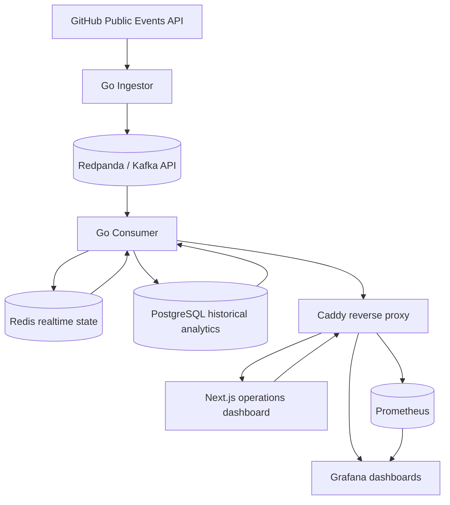
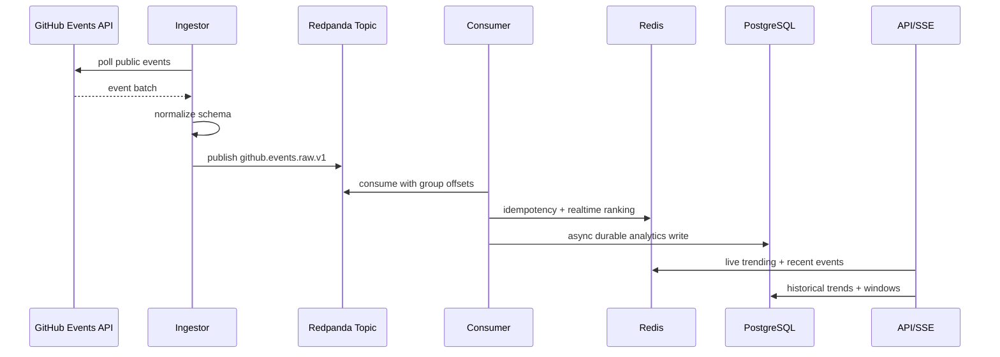
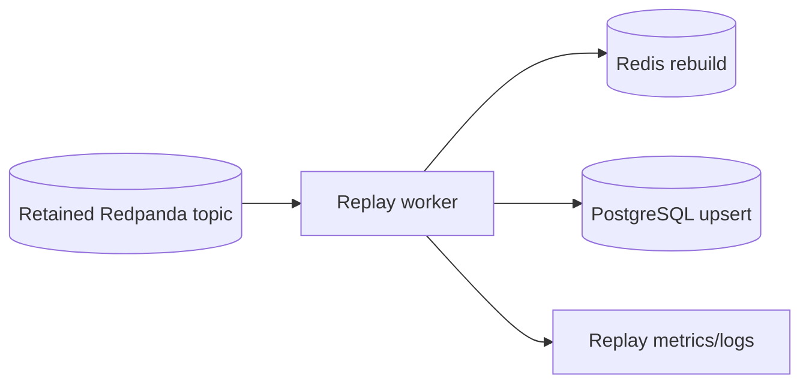
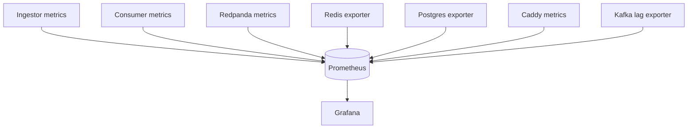
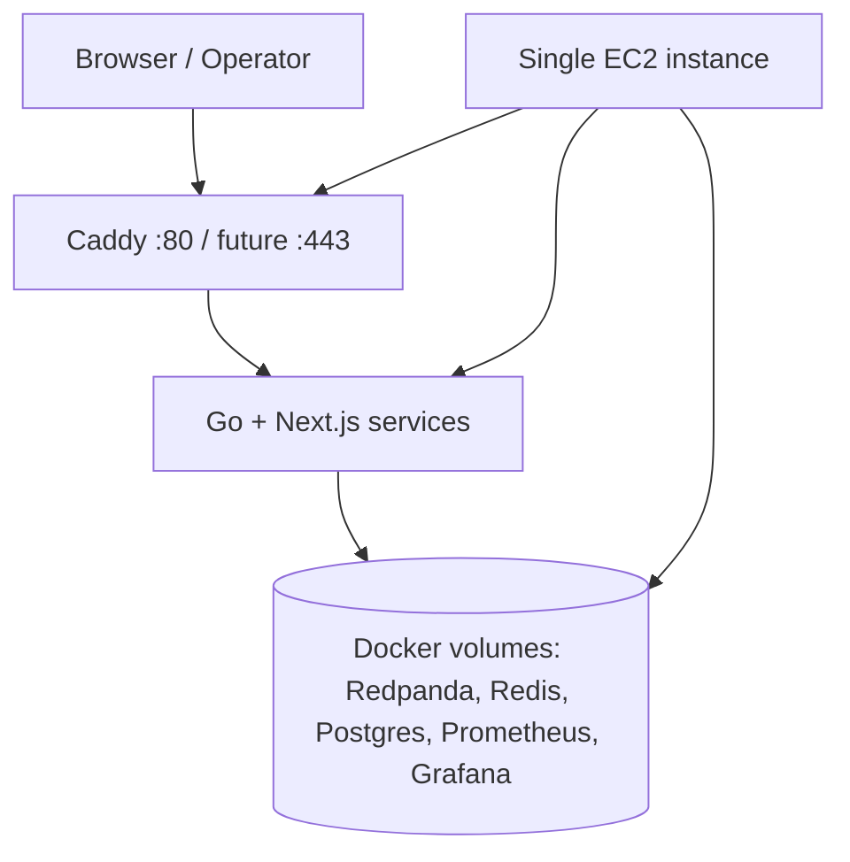

# Architecture

GitHub Pulse is an event-driven analytics platform. It is intentionally infrastructure-focused: the value is in ingestion, streaming, aggregation, persistence, replayability, observability, and operational recovery.

## System Architecture

## Event Flow

## Replay And Backfill

Replay is intentionally bounded and operator-controlled. Redis idempotency markers and PostgreSQL conflict handling make duplicate delivery safe for analytics recovery.

## Observability

## Deployment Architecture

This is production-style but not highly available. The single-node design keeps cost and operational complexity low while preserving real distributed systems concerns: queues, offsets, idempotency, backpressure, replay, and observability.
