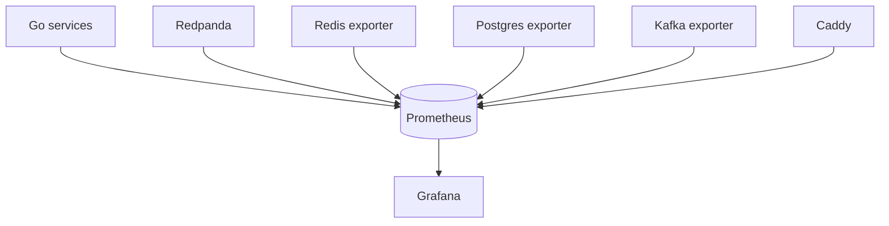

# Observability And Operations

Phase 5 adds a single-node observability stack that stays compatible with Docker Compose and low-cost EC2 deployment. Phase 6 extends it with benchmark, latency, and resilience views.

## Architecture



Prometheus scrapes:

- `ingestor:8080/metrics`
- `consumer:8081/metrics`
- `redpanda:9644/public_metrics`
- `kafka-exporter:9308`
- `redis-exporter:9121`
- `postgres-exporter:9187`
- `caddy:2019/metrics`

Grafana is provisioned from files under `ops/grafana`, so dashboards survive container recreation.

## Dashboards

Provisioned dashboards:

- System Overview
- Event Ingestion
- Consumer Processing
- Replay Operations
- Redis Aggregation
- PostgreSQL Persistence
- API Metrics
- Infrastructure Health
- Performance And Resilience

Open Grafana through Caddy:

```sh
open http://localhost/grafana/
```

For screenshots, open each dashboard after traffic has flowed for a few minutes and capture the full dashboard view with the time range set to the last hour.

Suggested public portfolio captures:

- System Overview dashboard after `make bench-small`.
- Performance And Resilience dashboard during `make k6-api`.
- PostgreSQL Persistence dashboard after bounded replay.
- Infrastructure Health dashboard after a recovery drill.

## Prometheus

Prometheus runs with local volume persistence and a default 15-day retention window:

```sh
open http://localhost/prometheus/
curl http://localhost:9090/prometheus/-/ready
curl "http://localhost:9090/prometheus/api/v1/targets"
```

Prometheus is bound to localhost by default. Caddy exposes it under `/prometheus/`.

## Reverse Proxy

Caddy is the HTTP entrypoint for local and production deployment. The default `ops/caddy/Caddyfile`:

- proxies `/` to the Next.js dashboard
- proxies `/api/*` to the Go consumer API
- proxies `/grafana/*` to Grafana
- proxies `/prometheus/*` to Prometheus
- enables gzip/zstd compression
- adds baseline security headers
- keeps SSE compatible for live event streams

TLS is intentionally staged. For production TLS, point DNS to the EC2 instance and replace the `:80` site block with the domain name in `ops/caddy/Caddyfile`.

## Operational Checks

```sh
docker compose ps
curl http://localhost/
curl http://localhost/api/trending/repos
curl -N --max-time 5 http://localhost/api/trending/repos/stream
curl http://localhost/prometheus/-/ready
curl http://localhost/grafana/api/health
```

Key alerts to add in a future phase:

- any `up == 0` target
- increasing consumer lag
- increasing persistence queue depth
- increasing PostgreSQL write failures
- Redis memory near maxmemory
- Redpanda unavailable or topic lag growing
- p95/p99 processing latency over the expected baseline
- persistence writes dropped above zero

## Benchmark Signals

During `make bench`, `make k6-api`, `make k6-sse`, or bounded replay, watch:

- `github_pulse_consumer_processing_latency_seconds` for p95/p99 latency.
- `github_pulse_consumer_persistence_queue_depth` for backpressure.
- `github_pulse_consumer_persistence_dropped_total` for lost async persistence writes.
- `kafka_consumergroup_lag` for consumer backlog.
- `github_pulse_consumer_sse_active_connections` for SSE load.
- `caddy_http_requests_total` for proxy request pressure.

## Recovery

- If Grafana loses dashboards, restart Grafana; provisioning reloads from `ops/grafana`.
- If Prometheus data is corrupted, remove only the `prometheus-data` volume after confirming dashboards and app data are safe.
- If exporter targets are down, verify the source service health first, then exporter logs.
- If Caddy is down, direct localhost service ports can still be used for recovery.
